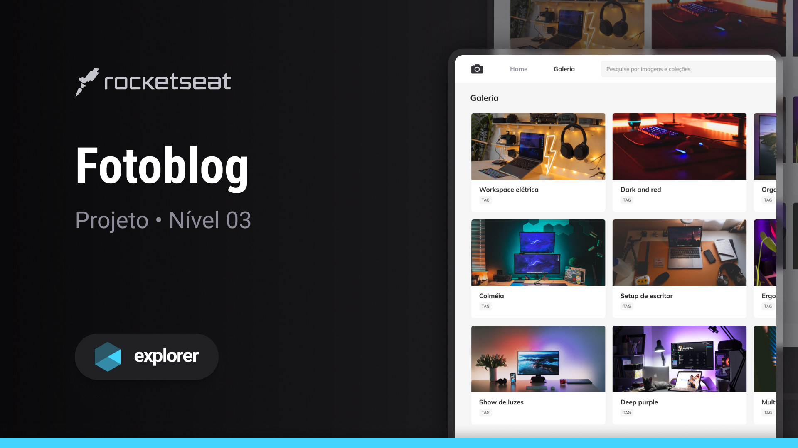

## 💻 Projeto

Esse é um projeto Web com Grid de imagens.

## 🚀 Tecnologias

Esse projeto foi desenvolvido durante o curso Explorer da Rocketseat com as seguintes tecnologias:

- HTML
- CSS

## 🏷️ Layout

Você pode visualizar o layout do projeto através [desse link](https://www.figma.com/file/Cv5OTySyFsZdAXctNwOW2M/Fotoblog-%E2%80%A2-Projeto-Explorer-(Community)?type=design&node-id=201-95&mode=design&t=7dd239LJrQwzbvih-0).
É necessário ter uma conta do [Figma](https://www.figma.com).
